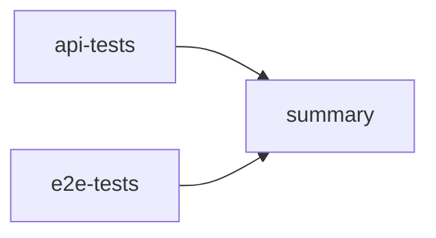

# ci-cd-test-pipeline

A multi-job GitHub Actions pipeline that runs the test suites of my two other QA portfolio repos and reports their results in one place:

- [`api-testing-automation`](https://github.com/ZetaCarrasco/api-testing-automation) — API tests with Python and pytest
- [`web-e2e-playwright`](https://github.com/ZetaCarrasco/web-e2e-playwright) — end-to-end UI tests with Playwright

This repo contains no tests of its own. It is an orchestration layer: it checks out the other repos, runs their suites in parallel, and summarizes the outcome. It exists to practice pipeline design (job dependencies, scheduled runs, cross-repo checkouts), which the single-repo workflows don't cover.

## Pipeline

| Job | What it does | Source repo |
|---|---|---|
| `api-tests` | Sets up Python 3.12, installs dependencies, runs `pytest tests/ -v` | `api-testing-automation` |
| `e2e-tests` | Sets up Node 20, installs both dependency sets and Chromium, runs the Playwright suite on Chromium, uploads the HTML report | `web-e2e-playwright` |
| `summary` | Waits for both jobs (`needs`), runs even if one failed (`if: always()`), writes a results table to the run's Summary page | — |

`api-tests` and `e2e-tests` run in parallel on separate runners. `summary` starts only when both have finished.

## Triggers

- **Push to `main`.**
- **Every day at 06:17 UTC** (03:17 in Brasília), on a schedule.
- **Manually**, from the Actions tab (`workflow_dispatch`).

The workflow does not run on pull requests. To test a change before merging it, run the workflow manually on the branch: Actions tab → QA Pipeline → Run workflow → pick the branch.

## Reading the results

- The **Summary** page of each run shows a table with the result of each stage.
- The Playwright **HTML report** is uploaded as the `playwright-report` artifact (kept for 14 days), even when the tests fail.

## Design notes / trade-offs

- **Source repos are checked out from their default branch**, not pinned to a commit. The nightly run therefore tests whatever is currently on `main` in both repos, which is useful for catching breakage, but runs are not reproducible. Pinning a `ref` would make them reproducible.
- **Chromium only.** The full four-browser matrix (Chromium, Firefox, WebKit, mobile Chrome) already lives in `web-e2e-playwright`'s own workflow, so repeating it here would add time without adding information.
- **The API tests depend on a public third-party API** (Restful-booker), which is shared and sometimes slow or down. A red run does not always mean a bug in my code.
- **Runner pinned to `ubuntu-24.04`.** GitHub is migrating the `ubuntu-latest` label to Ubuntu 26 during the weeks after October 19, 2026; pinning keeps the environment from changing unexpectedly under the tests.
- **Actions on Node 24 versions** (`checkout@v6`, `setup-python@v6`, `setup-node@v6`, `upload-artifact@v6`), after GitHub's deprecation warning for Node 20 actions.
- **Scheduled runs are best-effort.** GitHub may delay them under load, so the cron is set off the top of the hour, and in public repos it disables scheduled workflows after 60 days without repository activity.

### Possible improvements

- Pin the checked-out repos to a tag or commit, and bump them deliberately.
- Add a `pull_request` trigger so changes to the workflow are checked before merging.
- Move the `e2e-tests` job from Node 20 (past end of life) to a current LTS version.
- Add a static-analysis stage (linting, type checks) that fails fast before the test jobs.
- Publish a combined report, for example on GitHub Pages.